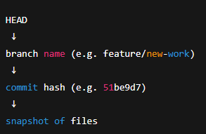

# Daily Git Workflow (Portfolio + Multi-Device Safe)

## Mental Model (Read Once)

`master` = stable / live

`feature/*` = work in progress

Device switching = sync only, not deployment

## A. Start of Day (Any Device)

```bash
git checkout master
git pull origin master
```

Purpose:

- Ensure your base is clean
- Avoid branching from stale history

## B. Start or Continue Work

If continuing an existing feature

```bash
git checkout feature/current-work
git pull
```

If starting new work



```bash
git checkout -b feature/new-work
```

```bash
git push -u origin HEAD
```

## C. During Work (Anytime)

Commit often:

```bash
git add .
git commit -m "Clear, specific message"
```

Optional but recommended backup:

```bash
git push
```

This push:

- Does not deploy
- Does not affect master
- Enables device switching safely

## D. Switching Devices (Critical Section)

On Device A (before leaving)

```bash
git status
git add .
git commit -m "WIP: state before device switch"
git push
```

That’s all.

On Device B (when arriving)

```bash
git fetch --all
git checkout feature/current-work
git pull
```

Continue work normally.

## E. End of Day (Optional but Clean)

If work is unfinished:

```bash
git push
```

If work is finished and ready to publish, continue to Section F.

## F. Finish Work (Deploy Step)

Only when fully done:

```bash
git checkout master
git pull origin master
git merge feature/current-work
git push origin master
```

This is the only step that updates your live portfolio.

## G. Cleanup (After Successful Merge)

```bash
git branch -d feature/current-work
git push origin --delete feature/current-work   # optional
```

## One-Page Daily Checklist

START DAY  
✓ pull master  
✓ checkout feature

WORK  
✓ commit often  
✓ push occasionally

SWITCH DEVICE?  
✓ commit  
✓ push  
✓ fetch + checkout + pull on new device

FINISHED?  
✓ merge → master  
✓ push master  
✓ delete feature branch

## Commands You Should NEVER Run

❌ git commit on master  
❌ git pull origin feature/other  
❌ git checkout origin/master  
❌ Merge feature → feature

## Why This Workflow Is Correct

Zero risk to live site

Clean, linear history

Works across multiple devices

Matches professional solo-developer practice

Scales to teams and PRs later